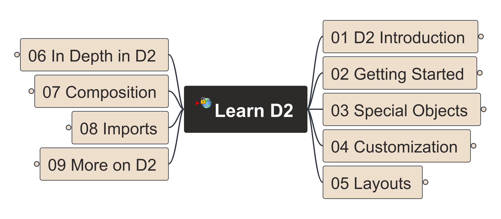

# Learn D2 Language - Declarative Diagramming

Learn, practice and sharing experience on D2 (the Declarative Diagramming) language

Base on [D2 Tour](https://d2lang.com/tour/), learn step-by-step modeling skills as below:

The demo will be packaged into Udemy and later my YouTube channel, stay tunes.

---
Any questions, post in Discussion Board please.
